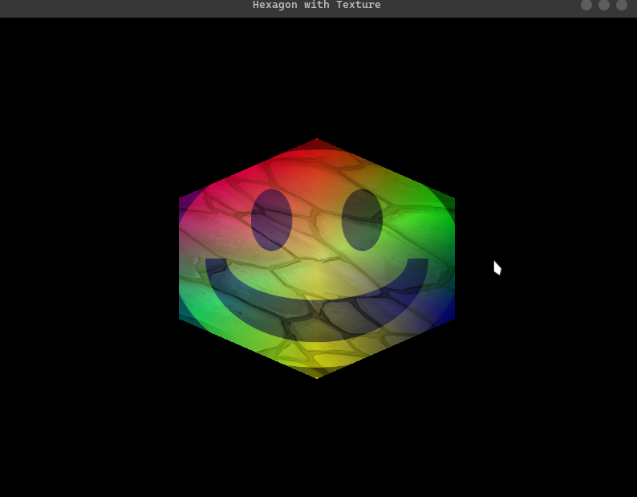

# Open GL contents

## Description

This is a repository to store all the code I write while learning Open GL.

This repo have the following structure:

- `src/` : This folder contains all the code I write.
- `include/` : This folder contains all the header files. (generic and specific to the project)
- `updates/` : This folder contains images of the progress I make.
- `README.md` : This file.

## Branches and their purpose

### Main

This branch contains the code that is stable and less documented so that there is no clutter in the code.

### Documentation

This branch contains the code that is stable and well documented so that it can be used as a reference.

You can go to the html directory and open the index.html file to see the documentation
if you guys have the "go live" extension in vscode then you can open the index.html file in the browser and see the documentation.

CHEERS !!

## To run the code

```bash
git clone <repo-url>
cd <repo-name>
```

```bash
mkdir build
cd build
cmake ..
make
./app
```

## Current progress

- Created a hexagon with texture and blending of colors
  

- Now the engine supports multiple textures (32!! OF THEM !!)
  

---

# DOCS

- [OpenGL](https://learnopengl.com/)
- [GLFW](https://www.glfw.org/docs/latest/)
- [GLAD](https://glad.dav1d.de/)
