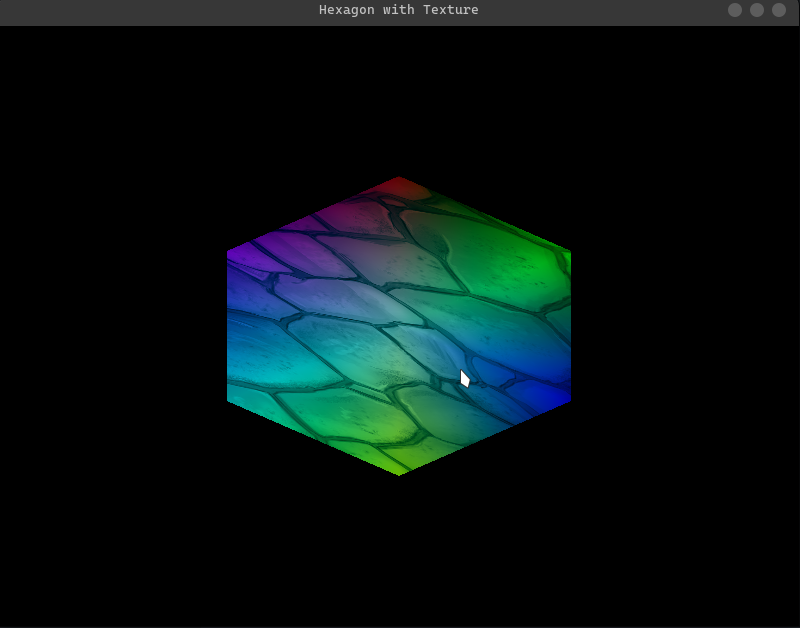

# Open GL contents

## Description
This is a repository to store all the code I write while learning Open GL.

This repo have the following structure:
- `src/` : This folder contains all the code I write.
- `include/` : This folder contains all the header files. (generic and specific to the project)
- `updates/` : This folder contains images of the progress I make.
- `README.md` : This file.

## To run the code

```bash
git clone <repo-url>
cd <repo-name>
```

```bash
mkdir build
cd build
cmake ..
make
./app
```

## Current progress
- Created a hexagon with texture and blending of colors


-------------------------------

# DOCS
- [OpenGL](https://learnopengl.com/)
- [GLFW](https://www.glfw.org/docs/latest/)
- [GLAD](https://glad.dav1d.de/)


